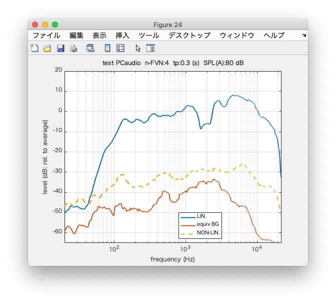
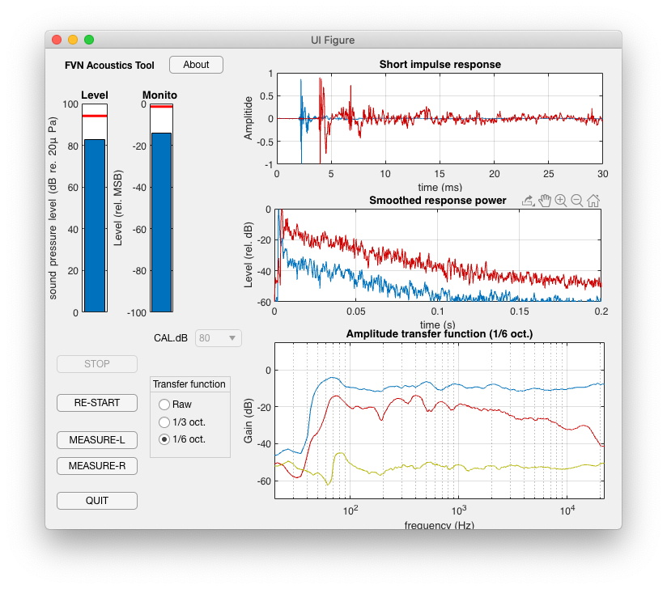
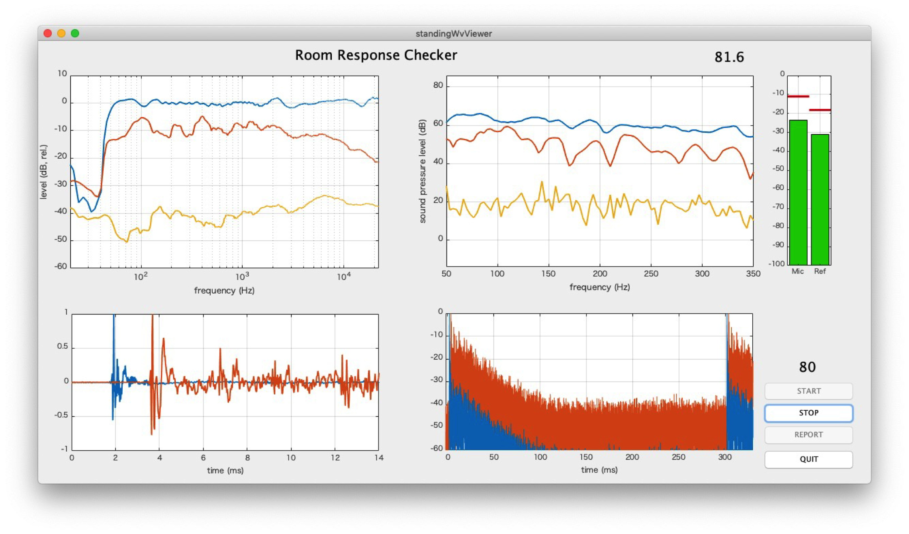

# FVN
Frequency domain variants of Velvet Noise, a flexible building unit for speech synthesis, psychoacoustic research and acoustic measurement.

## Introduction

This repository consists of tools and underlying elementary functions for acoustic mesaurements 
using a new set of test signals based on FVNs.

## Installation

Decompress the archive. Then, set MATLAB paths to src, test, and GUI folders. First, try the following command in the command window.

    testInstallation

Before passing twenty seconds (usually less than ten seconds...), the following message appears.

    'Passed (generateStandardFVN, generateFVN6real, generateSparseFVNset)'

## Getting started (Quick start)

If your PC has access to a mic and a loudspeaker (usually builtin), try the following command.

    output = allInOneFVNmeasurement('test')

It prompts the following message.

    'Measurement starts. Be quiet for 34 seconds. Please.'

Then, within two seconds noise starts. It lasts 15 seconds then noise stops. Please wait for about twenty seconds. 
This silence is for measuring background noise of the measurement environment.

Typically, after fourty seconds from the start, a figure similar to the following appears.



In this figure, the blue line represents the transfer function (gain) from the loudspeaker to the microphon.
The red line represents the effect of background noise. 
The effects are significantly reduced by synchronous averaging.
The yellow and dashed line represents the nonlinear component in the response.

It also output the following in the command window.

                             fvnFile: 'fvnMin200ms'
         averagedThirdOctaveResponse: [1×16384 double]
    averagedThirdOctaveNonlinearComp: [1×16384 double]
       averagedThirdOctaveBackground: [1×16384 double]
            averagedResponseWaveform: [15876×1 double]
          individualResponseWaveform: [15876×4 double]
          averagedBackgroundWaveform: [15876×1 double]
        individualBackgroundWaveform: [15876×4 double]
                            memoText: 'test'
                      number_of_FVNs: 4
                      responseLength: 0.3000
                  soundPressureLevel: 80
                         signalRange: [296945 312820]
                     backgroundRange: [795275 811150]
                   samplingFrequency: 44100
                        creationDate: '09-Jul-2019 21:51:38'
                      levelStructure: [1×1 struct]
                         elapsedTime: 38.8175
                    recordedWaveform: [1509376×1 double]

This is also the contents of the structured variable "output."

## Release note

### Refinement of the substantial update and removing outdated directories (10/Aug./2020)


### A substantial update of the interactive and realtime acoustic measurement tool with revision on FVN infrastructure (07/Aug./2020)

Please refer an article [PDF](http://arxiv.org/abs/2008.02439) for technical details.

### Preparation for Otogaku 2020: directory (ieiceAndAsj2020March) update

### A snapshot directory (ieiceAndAsj2020March) for FVN applications is added (04/March/2020)

Acoustic measurement tool (rtFVNRespToolPinkEx) and Auditory to voice production measurement tool (voiceModulationTestAppMCal) are added as supplement materials to IEICE technical meeting. A MATLAB live script for demonstrating orthogonalization of FVN-based sequences is added. Tools require Audio Toolbox.

### Audio Toolbox and AppDesigner are awsome (06/Jan./2020)

I will migrate to this environment. Time saving. Please check the new directory "audioToolbox." A real-time and interactive acoustic impulse measurement tool is available (rtFVNRespToolPinkEx). It has the following GUI. Check reference documents.



### Temporal envelope shaping based on nonlinear frequency axis warping (30/Oct/2019)

This pre-reliease is the last version which does not require "Audio Toolbox"

###  New! GUI application for stereo acoustic measurement in real-time (19/August/2019)

Refer to the Japanese document on the command
```
standingWvViewer
```
It brins the following GUI for the measurement.



## Directories

* src
  * MATLAB source of core functions and supporting files
* test
  * test script and functions 
* GUI 
  *  GUI applications 
* doc 
  * Technical documents and links to multimedia
* audioToolbox
  * Real-time and interactive tool for acoustic impulse response measurement developed using Audio System Toolbox and App Designer. (Standalone application for MacOS and Windows are linked from technical documents.)

## Technical details
A unit FVN is an impulse response of an all-pass filter generated from two sets of random numbers.
By convolving an FVN with the time-reversed version of itself yields a unit impulse.
An FVN has a localized envelope on the time axis.
In the broadest sense, it is a member of the time-stretched-pulse (TSP) and
appropriate for acoustic measurements.

Please check the references for details

## References

1. Hideki Kawahara, Ken-Ichi Sakakibara, Mitsunori Mizumachi, Masanori Morise, Hideki Banno: Simultaneous measurement of time-invariant linear and nonlinear, and random and extra responses using frequency domain variant of velvet noise, arXiv preprint arXiv:2008.02439 [link to arXiv]:https://arxiv.org/abs/2008.02439
1. Hideki Kawahara, Ken-Ichi Sakakibara, Mitsunori Mizumachi, Hideki Banno, Masanori Morise, Toshio Irino: Application of frequency domain variants of velvet noise to multi-aspect measurement of acoustic systems, IEICE Technical report, EA2019-47, pp.69-75, 2019-10.
1. Hideki Kawahara, Ken-Ichi Sakakibara, Mitsunori Mizumachi, Hideki Banno, Masanori Morise, Toshio Irino: Frequency domain variant of Velvet noise and its application to acoustic measurements, Audio and Speech Processing, arXiv:1909.04301 [eess.AS], [PDF](https://arxiv.org/abs/1909.04301)
1. 河原英紀, 榊原健一, & 水町光徳. (2019). 周波数領域 velvet noise を用いた音響計測手順の拡張について (応用音響). 電子情報通信学会技術研究報告= IEICE technical report: 信学技報, 119(115), 77-82.
1. Kawahara, H., Sakakibara, K. I., Morise, M., Banno, H., Toda, T., & Irino, T. (2018). Frequency domain variants of velvet noise and their application to speech processing and synthesis: with appendices. arXiv preprint arXiv:1806.06812.  [link to arXiV][FVN arxiv1]
[FVN arxiv1]:https://arxiv.org/abs/1806.06812
2. Kawahara, H., Sakakibara, K., Morise, M., Banno, H., Toda, T., Irino, T. (2018) Frequency Domain Variants of Velvet Noise and Their Application to Speech Processing and Synthesis. Proc. Interspeech 2018, 2027-2031, DOI: 10.21437/Interspeech.2018-43.  [link to ISCA archive][FVN isca1]
[FVN isca1]:https://www.isca-speech.org/archive/Interspeech_2018/abstracts/0043.html
3. 河原英紀, 森勢将雅, & 水町光徳. (2018). 周波数領域 velvet noise とパワースペクトルの静的表現を用いた音響計測の可能性について (応用音響). 電子情報通信学会技術研究報告= IEICE technical report: 信学技報, 118(190), 89-96.

***
For any issues/comments, please mail to:
[Hideki Kawahara][mymail]

[mymail]:mailto:kawahara@wakayama-u.ac.jp

